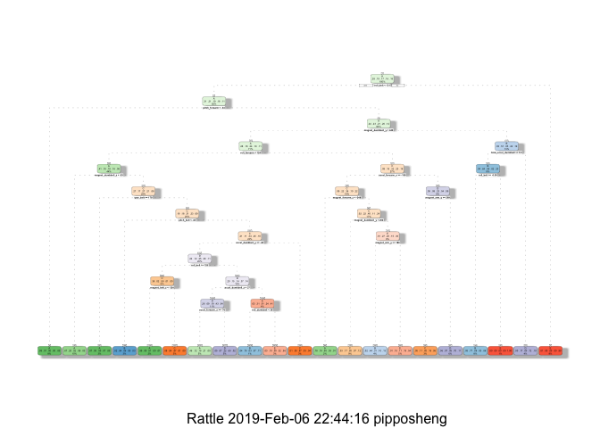
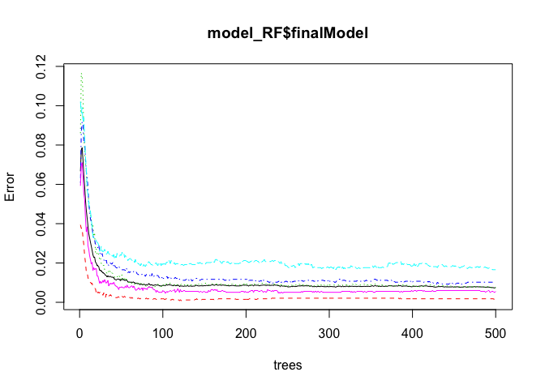
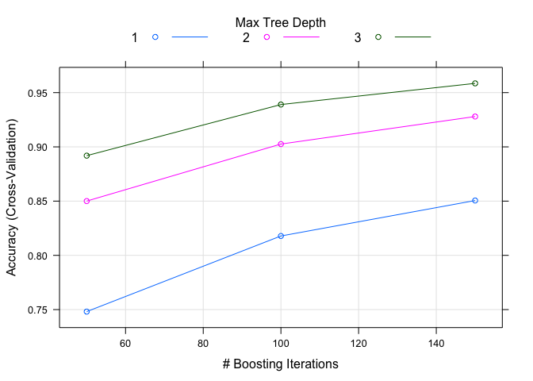

Practical Maching Learning Project
==================================

Biqing Sheng
------------

Executive Summary
-----------------

The goal of your project is to predict the manner in which they did the
exercise. This is the "classe" variable in the training set. Using
devices such as Jawbone Up, Nike FuelBand, and Fitbit it is now possible
to collect a large amount of data about personal activity relatively
inexpensively. These type of devices are part of the quantified self
movement – a group of enthusiasts who take measurements about themselves
regularly to improve their health, to find patterns in their behavior,
or because they are tech geeks. One thing that people regularly do is
quantify how much of a particular activity they do, but they rarely
quantify how well they do it. In this project, the goal is to use data
from accelerometers on the belt, forearm, arm, and dumbell of 6
participants. They were asked to perform barbell lifts correctly and
incorrectly in 5 different ways. More information is available from the
website here:
<http://web.archive.org/web/20161224072740/http:/groupware.les.inf.puc-rio.br/har>
(see the section on the Weight Lifting Exercise Dataset).

The training data for this project are available here:

<https://d396qusza40orc.cloudfront.net/predmachlearn/pml-training.csv>

The test data are available here:

<https://d396qusza40orc.cloudfront.net/predmachlearn/pml-testing.csv>

Three types of classification techniques were used for prediction:
decision tree, random forest, and generalized boosting model. The
accuracy of each model was evaluated. The model with the best accuracy
was used to predict the test data set.

Data Preparation
----------------

    # Loading required packages
    library(caret)

    ## Loading required package: lattice

    ## Loading required package: ggplot2

    library(rpart)
    library(rpart.plot)
    library(RColorBrewer)
    library(rattle)

    ## Rattle: A free graphical interface for data science with R.
    ## Version 5.2.0 Copyright (c) 2006-2018 Togaware Pty Ltd.
    ## Type 'rattle()' to shake, rattle, and roll your data.

    library(randomForest)

    ## randomForest 4.6-14

    ## Type rfNews() to see new features/changes/bug fixes.

    ## 
    ## Attaching package: 'randomForest'

    ## The following object is masked from 'package:rattle':
    ## 
    ##     importance

    ## The following object is masked from 'package:ggplot2':
    ## 
    ##     margin

    library(e1071)

    ## Warning: package 'e1071' was built under R version 3.5.2

    # Read in data
    pml_training <- read.csv("pml-training.csv")
    pml_testing <- read.csv("pml-testing.csv")
    # The first 7 variables were eliminated since there effects are minimal
    training1 <- pml_training[,-c(1:7)]
    testing1 <- pml_testing[,-c(1:7)]
    # Remove the column with missing values
    training2 <- training1[, colSums(is.na(training1)) == 0]
    testing2 <- testing1[, colSums(is.na(training1)) == 0]
    # Remove the variables with near zero variance
    NZV <- nearZeroVar(training2)
    training2 <- training2[,-NZV]
    dim(training2)

    ## [1] 19622    53

The original traing data set was seperated randomly. 60% was used for
training, 40% was used for validation.

    set.seed(121)
    inTrain <- createDataPartition(training2$classe, p = 0.6, list = FALSE)
    traindata <- training2[inTrain,]
    validdata <- training2[-inTrain,]
    dim(traindata)

    ## [1] 11776    53

Decision Tree Model
-------------------

    set.seed(121)
    model_DT <- rpart(classe~., data = traindata, method = "class")
    fancyRpartPlot(model_DT)

    prediction1 <- predict(model_DT, validdata, type = "class")
    cm1 <- confusionMatrix(prediction1,validdata$classe)

The accuracy of decision tree model is 0.7211318.

Random Forest Model
-------------------

    set.seed(121)
    trctrl <- trainControl(method = "cv", number = 5)
    model_RF <- train(classe~., data = traindata, method = "rf", trControl = trctrl, verbose=FALSE)
    plot(model_RF$finalModel)

    prediction2 <- predict(model_RF,validdata)
    cm2 <- confusionMatrix(prediction2,validdata$classe)

The accuracy of random forest model with 5-fold cross-validation is
0.9920979.

Generalized Boosting Model
--------------------------

    set.seed(121)
    trctrl <- trainControl(method = "cv", number = 5)
    model_GBM <- train(classe~., data = traindata, method = "gbm", trControl = trctrl, verbose = FALSE)
    plot(model_GBM)

    prediction3 <- predict(model_GBM,validdata)
    cm3 <- confusionMatrix(prediction3,validdata$classe)

The accuracy of generalized boosting model with 5-fold cross-validation
is 0.9602345.

Final Prediction for Test Data
------------------------------

    predict(model_RF,testing2)

    ##  [1] B A B A A E D B A A B C B A E E A B B B
    ## Levels: A B C D E
